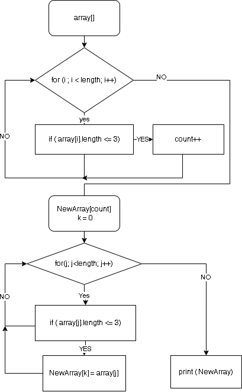

# Итоговая проверочная работа
1. Создать репозиторий на GitHub
2. Нарисовать блок-схему алгоритма (можно обойтись блок-схемой основной содержательной части, если вы выделяете её в отдельный метод)
3. Снабдить репозиторий оформленным текстовым описанием решения (файл README.md)
4. Написать программу, решающую поставленную задачу
5. Использовать контроль версий в работе над этим небольшим проектом (не должно быть так, что всё залито одним коммитом, как минимум этапы 2, 3, и 4 должны быть расположены в разных коммитах)

**Задача:** Написать программу, которая из имеющегося массива строк формирует новый массив из строк, длина которых меньше, либо равна 3 символам. Первоначальный массив можно ввести с клавиатуры, либо задать на старте выполнения алгоритма. При решении не рекомендуется пользоваться коллекциями, лучше обойтись исключительно массивами.

*Примеры:*
>[“Hello”, “2”, “world”, “:-)”] → [“2”, “:-)”]

>[“1234”, “1567”, “-2”, “computer science”] → [“-2”]

>[“Russia”, “Denmark”, “Kazan”] → []

## Решение ##
____________________________

1. Программа должна запросить пользователя ввести строки в массив ;
2. Цикл проходит все данные массива и проверяет их на количество занаков ;
3. Если количество знаков меньше либо равно 3 записываем данные в новый массив ;
4. Выводим в консоль полученный массив .

## Блоксхема
_____________________________

